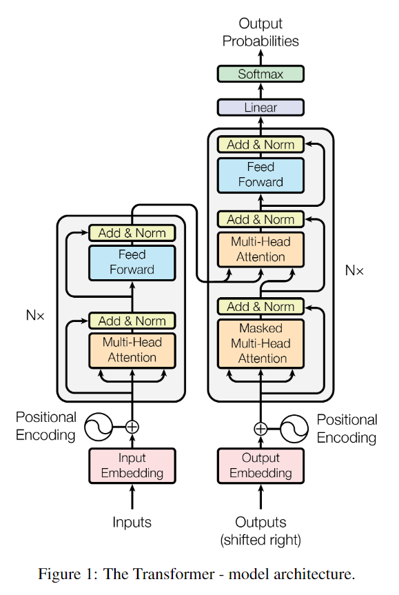
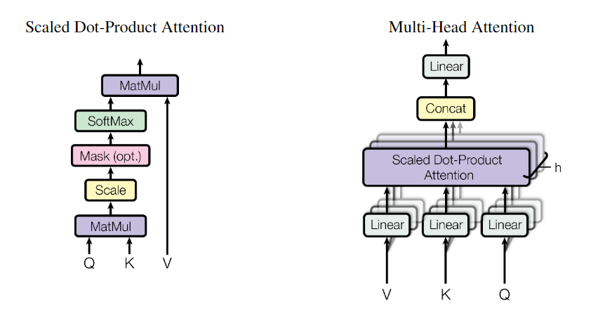

# Attention is all you need


Attention mechanisms have become an integral part of compelling sequence modeling and transduction models in various tasks, allowing modeling of dependencies without regard to their distance in the input or output sequences.


Paper: [Attention is all you need](https://arxiv.org/pdf/1706.03762.pdf)

Code: [leviswind/pytorch-transformer](https://github.com/leviswind/pytorch-transformer)

Other implementation: [jadore801120/attention-is-all-you-need-pytorch](https://github.com/jadore801120/attention-is-all-you-need-pytorch)





Differences with the original paper

I don't intend to replicate the paper exactly. Rather, I aim to implement the main ideas in the paper and verify them in a SIMPLE and QUICK way. In this respect, some parts in my code are different than those in the paper. 

* I constructed vocabulary with words, not subwords for simplicity. Of course, you can try bpe or word-piece if you want.
* I parameterized positional encoding. The paper used some sinusoidal formula, but Noam, one of the authors, says they both work. 
* The paper adjusted the learning rate to global steps. I fixed the learning to a small number, 0.0001 simply because training was reasonably fast enough with the small dataset (Only a couple of hours on a single GTX 1060!!).

## modules


### embedding

```python
class embedding(nn.Module):

    def __init__(self, vocab_size, num_units, zeros_pad=True, scale=True):
        '''Embeds a given Variable.
        Args:
          vocab_size: An int. Vocabulary size.
          num_units: An int. Number of embedding hidden units.
          zero_pad: A boolean. If True, all the values of the fist row (id 0)
            should be constant zeros.
          scale: A boolean. If True. the outputs is multiplied by sqrt num_units.
        '''
        super(embedding, self).__init__()
        self.vocab_size = vocab_size
        self.num_units = num_units
        self.zeros_pad = zeros_pad
        self.scale = scale
        self.lookup_table = Parameter(torch.Tensor(vocab_size, num_units))
        nn.init.xavier_normal(self.lookup_table.data)
        if self.zeros_pad:
            self.lookup_table.data[0, :].fill_(0)

    def forward(self, inputs):
        if self.zeros_pad:
            self.padding_idx = 0
        else:
            self.padding_idx = -1
        outputs = self._backend.Embedding.apply(
            inputs, self.lookup_table, self.padding_idx, None, 2, False, False)  # copied from torch.nn.modules.sparse.py

        if self.scale:
            outputs = outputs * (self.num_units ** 0.5)

        return outputs
```


### layer normalization

```python
class layer_normalization(nn.Module):

    def __init__(self, features, epsilon=1e-8):
        '''Applies layer normalization.
        Args:
          epsilon: A floating number. A very small number for preventing ZeroDivision Error.
        '''
        super(layer_normalization, self).__init__()
        self.epsilon = epsilon
        self.gamma = nn.Parameter(torch.ones(features))
        self.beta = nn.Parameter(torch.zeros(features))

    def forward(self, x):
        mean = x.mean(-1, keepdim=True)
        std = x.std(-1, keepdim=True)
        return self.gamma * (x - mean) / (std + self.epsilon) + self.beta
```


### positional encoding

```python
class positional_encoding(nn.Module):

    def __init__(self, num_units, zeros_pad=True, scale=True):
        '''Sinusoidal Positional_Encoding.
        Args:
          num_units: Output dimensionality
          zero_pad: Boolean. If True, all the values of the first row (id = 0) should be constant zero
          scale: Boolean. If True, the output will be multiplied by sqrt num_units(check details from paper)
        '''
        super(positional_encoding, self).__init__()
        self.num_units = num_units
        self.zeros_pad = zeros_pad
        self.scale = scale

    def forward(self, inputs):
        # inputs: A 2d Tensor with shape of (N, T).
        N, T = inputs.size()[0: 2]

        # First part of the PE function: sin and cos argument
        position_ind = Variable(torch.unsqueeze(torch.arange(0, T), 0).repeat(N, 1).long())
        position_enc = torch.Tensor([
            [pos / np.power(10000, 2. * i / self.num_units) for i in range(self.num_units)]
            for pos in range(T)])

        # Second part, apply the cosine to even columns and sin to odds.
        position_enc[:, 0::2] = torch.sin(position_enc[:, 0::2])  # dim 2i
        position_enc[:, 1::2] = torch.cos(position_enc[:, 1::2])  # dim 2i+1

        # Convert to a Variable
        lookup_table = Variable(position_enc)

        if self.zeros_pad:
            lookup_table = torch.cat((Variable(torch.zeros(1, self.num_units)),
                                     lookup_table[1:, :]), 0)
            padding_idx = 0
        else:
            padding_idx = -1

        outputs = self._backend.Embedding.apply(
            position_ind, lookup_table, padding_idx, None, 2, False, False)   # copied from torch.nn.modules.sparse.py

        if self.scale:
            outputs = outputs * self.num_units ** 0.5

        return outputs
```

### multihead attention

```python
class multihead_attention(nn.Module):

    def __init__(self, num_units, num_heads=8, dropout_rate=0, causality=False):
        '''Applies multihead attention.
        Args:
            num_units: A scalar. Attention size.
            dropout_rate: A floating point number.
            causality: Boolean. If true, units that reference the future are masked.
            num_heads: An int. Number of heads.
        '''
        super(multihead_attention, self).__init__()
        self.num_units = num_units
        self.num_heads = num_heads
        self.dropout_rate = dropout_rate
        self.causality = causality
        self.Q_proj = nn.Sequential(nn.Linear(self.num_units, self.num_units), nn.ReLU())
        self.K_proj = nn.Sequential(nn.Linear(self.num_units, self.num_units), nn.ReLU())
        self.V_proj = nn.Sequential(nn.Linear(self.num_units, self.num_units), nn.ReLU())

        self.output_dropout = nn.Dropout(p=self.dropout_rate)

        self.normalization = layer_normalization(self.num_units)

    def forward(self, queries, keys, values):
        # keys, values: same shape of [N, T_k, C_k]
        # queries: A 3d Variable with shape of [N, T_q, C_q]

        # Linear projections
        Q = self.Q_proj(queries)  # (N, T_q, C)
        K = self.K_proj(keys)  # (N, T_q, C)
        V = self.V_proj(values)  # (N, T_q, C)

        # Split and concat
        Q_ = torch.cat(torch.chunk(Q, self.num_heads, dim=2), dim=0)  # (h*N, T_q, C/h)
        K_ = torch.cat(torch.chunk(K, self.num_heads, dim=2), dim=0)  # (h*N, T_q, C/h)
        V_ = torch.cat(torch.chunk(V, self.num_heads, dim=2), dim=0)  # (h*N, T_q, C/h)

        # Multiplication
        outputs = torch.bmm(Q_, K_.permute(0, 2, 1))  # (h*N, T_q, T_k)

        # Scale
        outputs = outputs / (K_.size()[-1] ** 0.5)

        # Key Masking
        key_masks = torch.sign(torch.abs(torch.sum(keys, dim=-1)))  # (N, T_k)
        key_masks = key_masks.repeat(self.num_heads, 1)  # (h*N, T_k)
        key_masks = torch.unsqueeze(key_masks, 1).repeat(1, queries.size()[1], 1)  # (h*N, T_q, T_k)

        padding = Variable(torch.ones(*outputs.size()).cuda() * (-2 ** 32 + 1))
        condition = key_masks.eq(0.).float()
        outputs = padding * condition + outputs * (1. - condition)

        # Causality = Future blinding
        if self.causality:
            diag_vals = torch.ones(*outputs[0, :, :].size()).cuda()  # (T_q, T_k)
            tril = torch.tril(diag_vals, diagonal=0)  # (T_q, T_k)
            # print(tril)
            masks = Variable(torch.unsqueeze(tril, 0).repeat(outputs.size()[0], 1, 1))  # (h*N, T_q, T_k)

            padding = Variable(torch.ones(*masks.size()).cuda() * (-2 ** 32 + 1))
            condition = masks.eq(0.).float()
            outputs = padding * condition + outputs * (1. - condition)

        # Activation
        outputs = F.softmax(outputs, dim=-1)  # (h*N, T_q, T_k)

        # Query Masking
        query_masks = torch.sign(torch.abs(torch.sum(queries, dim=-1)))  # (N, T_q)
        query_masks = query_masks.repeat(self.num_heads, 1)  # (h*N, T_q)
        query_masks = torch.unsqueeze(query_masks, 2).repeat(1, 1, keys.size()[1])  # (h*N, T_q, T_k)
        outputs = outputs * query_masks

        # Dropouts
        outputs = self.output_dropout(outputs)  # (h*N, T_q, T_k)

        # Weighted sum
        outputs = torch.bmm(outputs, V_)  # (h*N, T_q, C/h)

        # Restore shape
        outputs = torch.cat(torch.chunk(outputs, self.num_heads, dim=0), dim=2)  # (N, T_q, C)

        # Residual connection
        outputs += queries

        # Normalize
        outputs = self.normalization(outputs)  # (N, T_q, C)

        return outputs
```


### feed forward

```python
class feedforward(nn.Module):

    def __init__(self, in_channels, num_units=[2048, 512]):
        '''Point-wise feed forward net.
        Args:
          in_channels: a number of channels of inputs
          num_units: A list of two integers.
        '''
        super(feedforward, self).__init__()
        self.in_channels = in_channels
        self.num_units = num_units

        # nn.Linear is faster than nn.Conv1d
        self.conv = False
        if self.conv:
            params = {'in_channels': self.in_channels, 'out_channels': self.num_units[0],
                      'kernel_size': 1, 'stride': 1, 'bias': True}
            self.conv1 = nn.Sequential(nn.Conv1d(**params), nn.ReLU())
            params = {'in_channels': self.num_units[0], 'out_channels': self.num_units[1],
                      'kernel_size': 1, 'stride': 1, 'bias': True}
            self.conv2 = nn.Conv1d(**params)
        else:
            self.conv1 = nn.Sequential(nn.Linear(self.in_channels, self.num_units[0]), nn.ReLU())
            self.conv2 = nn.Linear(self.num_units[0], self.num_units[1])
        self.normalization = layer_normalization(self.in_channels)

    def forward(self, inputs):
        if self.conv:
            inputs = inputs.permute(0, 2, 1)
        outputs = self.conv1(inputs)
        outputs = self.conv2(outputs)

        # Residual connection
        outputs += inputs

        # Layer normalization
        if self.conv:
            outputs = self.normalization(outputs.permute(0, 2, 1))
        else:
            outputs = self.normalization(outputs)

        return outputs

```

### label smoothing


```python
class label_smoothing(nn.Module):

    def __init__(self, epsilon=0.1):
        '''Applies label smoothing. See https://arxiv.org/abs/1512.00567.
        Args:
            epsilon: Smoothing rate.
        '''
        super(label_smoothing, self).__init__()
        self.epsilon = epsilon

    def forward(self, inputs):
        K = inputs.size()[-1]
        return ((1 - self.epsilon) * inputs) + (self.epsilon / K)

```


Image from: [here](https://github.com/DevSinghSachan/Attention_is_All_You_Need)


## Attention

```python
class AttModel(nn.Module):
    def __init__(self, hp_, enc_voc, dec_voc):
        '''Attention is all you nedd. https://arxiv.org/abs/1706.03762
        Args:
            hp: Hyper Parameters
            enc_voc: vocabulary size of encoder language
            dec_voc: vacabulary size of decoder language
        '''
        super(AttModel, self).__init__()
        self.hp = hp_

        self.enc_voc = enc_voc
        self.dec_voc = dec_voc

        #encoder
        self.enc_emb = embedding(self.enc_voc, self.hp.hidden_units, scale=True)

        if self.hp.sinusoid:
            self.enc_positional_encoding = positional_encoding(num_units=self.hp.hidden_units,
                                                               zeros_pad=False,
                                                               scale=False)
        else:
            self.enc_positional_encoding = embedding(self.hp.maxlen, self.hp.hidden_units, zeros_pad=False, scale=False)
        self.enc_dropout = nn.Dropout(self.hp.dropout_rate)
        for i in range(self.hp.num_blocks):
            self.__setattr__('enc_self_attention_%d' % i, multihead_attention(num_units=self.hp.hidden_units,
                                                                              num_heads=self.hp.num_heads,
                                                                              dropout_rate=self.hp.dropout_rate,
                                                                              causality=False))
            self.__setattr__('enc_feed_forward_%d' % i, feedforward(self.hp.hidden_units,
                                                                    [4 * self.hp.hidden_units,
                                                                     self.hp.hidden_units]))

        #decoder
        self.dec_emb = embedding(self.dec_voc, self.hp.hidden_units, scale=True)
        if self.hp.sinusoid:
            self.dec_positional_encoding = positional_encoding(num_units=self.hp.hidden_units,
                                                               zeros_pad=False,
                                                               scale=False)
        else:
            self.dec_positional_encoding = embedding(self.hp.maxlen, self.hp.hidden_units, zeros_pad=False, scale=False)

        self.dec_dropout = nn.Dropout(self.hp.dropout_rate)
        for i in range(self.hp.num_blocks):
            self.__setattr__('dec_self_attention_%d' % i,
                             multihead_attention(num_units=self.hp.hidden_units,
                                                 num_heads=self.hp.num_heads,
                                                 dropout_rate=self.hp.dropout_rate,
                                                 causality=True))
            self.__setattr__('dec_vanilla_attention_%d' % i,
                             multihead_attention(num_units=self.hp.hidden_units,
                                                 num_heads=self.hp.num_heads,
                                                 dropout_rate=self.hp.dropout_rate,
                                                 causality=False))
            self.__setattr__('dec_feed_forward_%d' % i, feedforward(self.hp.hidden_units,
                                                                    [4 * self.hp.hidden_units,
                                                                     self.hp.hidden_units]))
        self.logits_layer = nn.Linear(self.hp.hidden_units, self.dec_voc)
        self.label_smoothing = label_smoothing()
        #self.losslayer = nn.CrossEntropyLoss(reduce=False)

    def forward(self, x, y):
        #define decoder inputs
        self.decoder_inputs = torch.cat([Variable(torch.ones(y[:, :1].size()).cuda() * 2).long(), y[:, :-1]], dim=-1)  # 2:<S>

        #Encoder
        self.enc = self.enc_emb(x)
        #Positional Encoding
        if self.hp.sinusoid:
            self.enc += self.enc_positional_encoding(x)
        else:
            self.enc += self.enc_positional_encoding(
                Variable(torch.unsqueeze(torch.arange(0, x.size()[1]), 0).repeat(x.size(0), 1).long().cuda()))
        self.enc = self.enc_dropout(self.enc)
        #Blocks
        for i in range(self.hp.num_blocks):
            self.enc = self.__getattr__('enc_self_attention_%d' % i)(self.enc, self.enc, self.enc)
            #Feed Forward
            self.enc = self.__getattr__('enc_feed_forward_%d' % i)(self.enc)
        #Decoder
        self.dec = self.dec_emb(self.decoder_inputs)
        #Positional Encoding
        if self.hp.sinusoid:
            self.dec += self.dec_positional_encoding(self.decoder_inputs)
        else:
            self.dec += self.dec_positional_encoding(
                Variable(torch.unsqueeze(torch.arange(0, self.decoder_inputs.size()[1]), 0).repeat(self.decoder_inputs.size(0), 1).long().cuda()))

        #Dropout
        self.dec = self.dec_dropout(self.dec)
        #Blocks
        for i in range(self.hp.num_blocks):
            #self-attention
            self.dec = self.__getattr__('dec_self_attention_%d' % i)(self.dec, self.dec, self.dec)
            #vanilla attention
            self.dec = self.__getattr__('dec_vanilla_attention_%d' % i)(self.dec, self.enc, self.enc)
            #feed forward
            self.dec = self.__getattr__('dec_feed_forward_%d' % i)(self.dec)

        #Final linear projection
        self.logits = self.logits_layer(self.dec)
        self.probs = F.softmax(self.logits, dim=-1).view(-1, self.dec_voc)
        _, self.preds = torch.max(self.logits, -1)
        self.istarget = (1. - y.eq(0.).float()).view(-1)
        self.acc = torch.sum(self.preds.eq(y).float().view(-1) * self.istarget) / torch.sum(self.istarget)

        #Loss
        self.y_onehot = torch.zeros(self.logits.size()[0] * self.logits.size()[1], self.dec_voc).cuda()
        self.y_onehot = Variable(self.y_onehot.scatter_(1, y.view(-1, 1).data, 1))

        self.y_smoothed = self.label_smoothing(self.y_onehot)

        #self.loss = self.losslayer(self.probs, self.y_smoothed)
        self.loss = - torch.sum(self.y_smoothed * torch.log(self.probs), dim=-1)
        #print(self.loss)

        self.mean_loss = torch.sum(self.loss * self.istarget) / torch.sum(self.istarget)

        return self.mean_loss, self.preds, self.acc
```