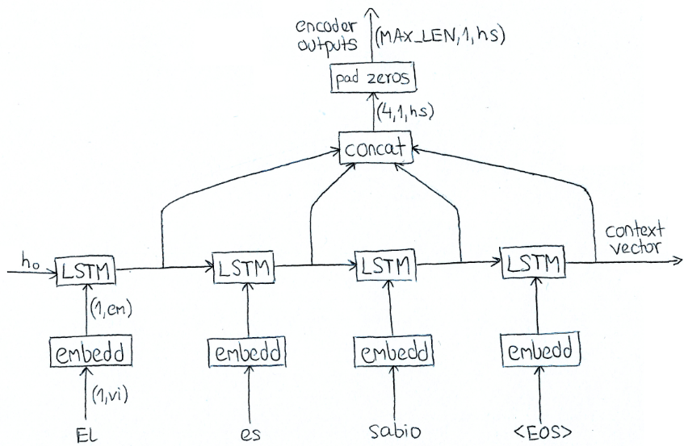
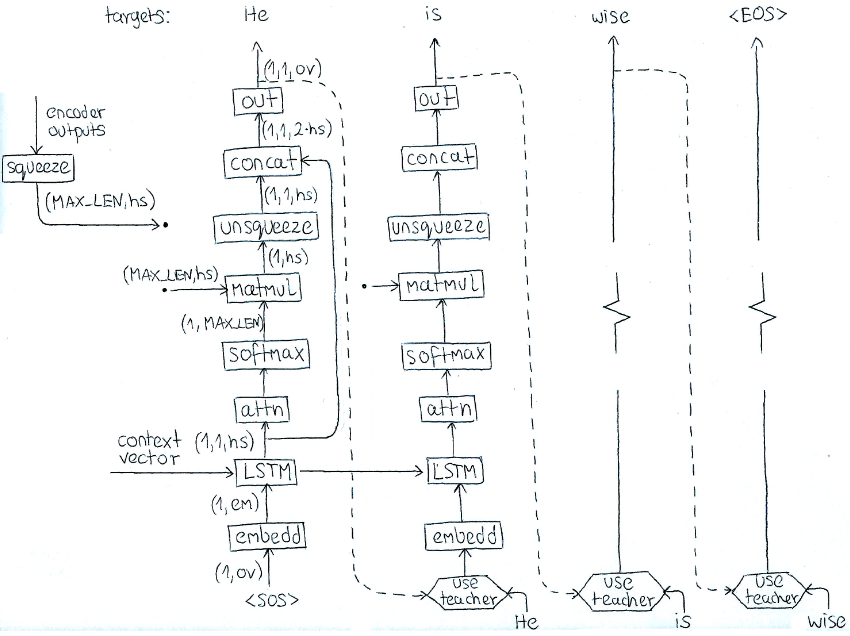

# Sequence to Sequence

Code: [WojciechMormul/seq2seq](https://github.com/WojciechMormul/seq2seq)


PyTroch implementation of Sequence to Sequence model for machine translation, where two recurrent neural networks work together to transform one sequence to another.

## Encoder

Encoder reads an input sequence and outputs single context vector and hidden states from every timestep.



```python
class Encoder(nn.Module):
	
    def __init__(self, vocab_size, embedd_size, hidden_size):
		
        super(Encoder, self).__init__()
        
        self.hidden_size = hidden_size
        self.embedding = nn.Embedding(vocab_size, embedd_size)
        self.lstm = nn.LSTM(embedd_size, hidden_size)

    def forward(self, input_seq, hidden):
		
		# input - LongTensor of shape(seq_len, 1)
		# hidden - tuple (hidden_state, cell-state), each element is floatTensor of shape(1, 1, hidden_size)

		embedded = self.embedding(input_seq) # floatTensor of shape (seq_len, 1, embedd_size)
		output, hidden = self.lstm(embedded, hidden) # floatTensor of shape (seq_len, 1, hidden_size)

		return output, hidden

    def initHidden(self):
		
        return (Variable(torch.zeros(1, 1, self.hidden_size)).cuda(),
				Variable(torch.zeros(1, 1, self.hidden_size)).cuda())
```


## Decoder



```python
class Decoder(nn.Module):
	
	def __init__(self, vocab_size, embedd_size, hidden_size):
		
		super(Decoder, self).__init__()
        
		self.hidden_size = hidden_size
		self.embedding = nn.Embedding(vocab_size, embedd_size)
		self.lstm = nn.LSTM(embedd_size, hidden_size)
		self.atten = nn.Linear(hidden_size, MAX_LENGTH)
		self.out = nn.Linear(2*hidden_size, vocab_size)
        
	def forward(self, input, hidden, encoder_outputs, use_teacher):
	
		if use_teacher == True: # pass target words to decoder inputs
		
			# input - LongTensor of shape(seq_len, 1)
			# hidden - tuple (hidden_state, cell-state), each element is floatTensor of shape(1, 1, hidden_size)
			# encoder_outputs - floatTensor of shape(MAX_LENGTH, 1, hidden_size)
			
			embedded = self.embedding(input) # floatTensor of shape (seq_len, 1, embedd_size)
			output, hidden = self.lstm(embedded, hidden) # floatTensor of shape (seq_len, 1, hidden_size)
			attentions = F.softmax(self.atten(output), dim=2) # floatTensor of shape (seq_len, 1, MAX_LENGTH)
			context_vector = torch.matmul(torch.squeeze(attentions, 1), torch.squeeze(encoder_outputs, 1))
			context_vector = context_vector.unsqueeze(1) # floatTensor of shape (seq len, 1, hidden_size)
			attention_vector = torch.cat((context_vector, output), 2)
			output = self.out(attention_vector) # floatTensor of shape (seq_len, 1, vocab_size)
			output = F.log_softmax(output, dim=2)
			
		else: # at each time step pass computed word to decoder input 
			
			input_length = input.size()[0]			
			input_token = input[0].unsqueeze(0)
			output = []
			
			for i in range(input_length):
			
				embedded = self.embedding(input_token)
				output_token, hidden = self.lstm(embedded, hidden)
				attentions = F.softmax(self.atten(output_token), dim=2)	
				
				context_vector = torch.matmul(torch.squeeze(attentions, 1),torch.squeeze(encoder_outputs, 1))
				context_vector = context_vector.unsqueeze(1)
				attention_vector = torch.cat((context_vector, output_token), 2)
				output_token = self.out(attention_vector)
				preds_token = F.log_softmax(output_token, dim=2)
				
				topv, topi = preds_token.topk(1)
				pred_token = topi[0]
				output.append(preds_token)
				input_token = pred_token

			output = torch.cat(output,0)

		return output
```