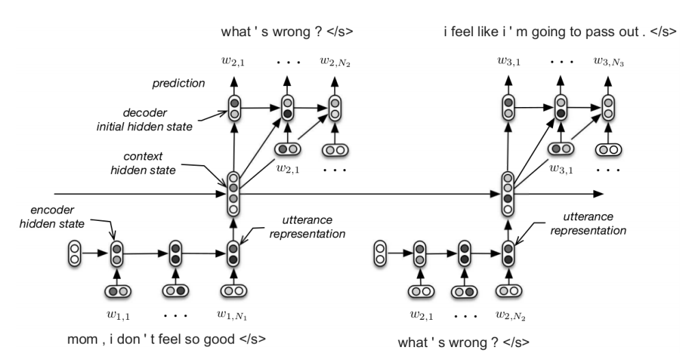

# Hierarchical Encoder Decoder Sequence to Sequence Model

Paper: [Building End-To-End Dialogue Systems Using Generative Hierarchical Neural Network Models](https://arxiv.org/abs/1507.04808)

Code: [koustuvsinha/hred-py](https://github.com/koustuvsinha/hred-py)




### EncoderRNN

```python
class EncoderRNN(nn.Module):
    def __init__(self, input_size, hidden_size, n_layers=1):
        super(EncoderRNN, self).__init__()
        self.n_layers = n_layers
        self.hidden_size = hidden_size

        self.embedding = nn.Embedding(input_size, hidden_size)
        self.gru = nn.GRU(hidden_size, hidden_size)

    def forward(self, input, hidden):
        embedded = self.embedding(input).view(1, 1, -1)
        output = embedded
        #h0,c0 = hidden
        for i in range(self.n_layers):
            output, hidden = self.gru(output, hidden)
        #hidden = (h1,c1)
        return output, hidden

    def initHidden(self):
        result = Variable(torch.zeros(1, 1, self.hidden_size))
        #cell = Variable(torch.zeros(1,1,self.hidden_size))
        if use_cuda:
            return result.cuda()
        else:
            return result
```

### ContextRNN

```python
class ContextRNN(nn.Module):
    def __init__(self, hidden_size, output_size, n_layers=1):
        super(ContextRNN, self).__init__()
        self.n_layers = n_layers
        self.hidden_size = hidden_size

        self.embedding = nn.Embedding(output_size, hidden_size)
        self.gru = nn.GRU(hidden_size, hidden_size)

    def forward(self, input, hidden):
        #print input
        #output = self.embedding(input).view(1, 1, -1)
        output = input.view(1,1,-1)
        for i in range(self.n_layers):
            output, hidden = self.gru(output, hidden)
        return output, hidden

    def initHidden(self):
        result = Variable(torch.zeros(1, 1, self.hidden_size))
        if use_cuda:
            return result.cuda()
        else:
            return result
```

### AttnDecoderRNN

```python
#for hred, decoder should also take the context vector and multiply that with the hidden state to form the new hidden state

class AttnDecoderRNN(nn.Module):
    def __init__(self, hidden_size, output_size, n_layers=1, dropout_p=0.1, max_length=MAX_LENGTH):
        super(AttnDecoderRNN, self).__init__()
        self.hidden_size = hidden_size
        self.output_size = output_size
        self.n_layers = n_layers
        self.dropout_p = dropout_p
        self.max_length = max_length

        self.embedding = nn.Embedding(self.output_size, self.hidden_size)
        self.attn = nn.Linear(self.hidden_size * 2, self.max_length)
        self.attn_combine = nn.Linear(self.hidden_size * 2, self.hidden_size)
        self.dropout = nn.Dropout(self.dropout_p)
        self.gru = nn.GRU(self.hidden_size, self.hidden_size)
        self.out = nn.Linear(self.hidden_size, self.output_size)

    def forward(self, input, hidden, encoder_output, encoder_outputs,context):
        embedded = self.embedding(input).view(1, 1, -1)
        embedded = self.dropout(embedded)

        attn_weights = F.softmax(
            self.attn(torch.cat((embedded[0], hidden[0]), 1)))
        attn_applied = torch.bmm(attn_weights.unsqueeze(0), # bmm - matmul
                                 encoder_outputs.unsqueeze(0))

        output = torch.cat((embedded[0], attn_applied[0]), 1)
        output = self.attn_combine(output).unsqueeze(0)

        #inputs are concatenation of previous output and context
        for i in range(self.n_layers):
            output = F.relu(output)
            output = torch.cat((output,context),0)
            output, hidden = self.gru(output, hidden)

        output = F.log_softmax(self.out(output[0])) # log softmax is done for NLL Criterion. We could use CrossEntropyLoss to avoid calculating this
        return output, hidden, attn_weights

    def initHidden(self):
        result = Variable(torch.zeros(1, 1, self.hidden_size))
        if use_cuda:
            return result.cuda()
        else:
            return result
```