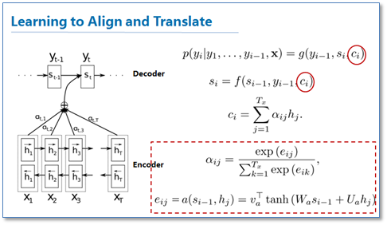

#  Neural Machine Translation by Jointly Learning to Align and Translate


Paper: [Neural Machine Translation by Jointly Learning to Align and Translate](https://arxiv.org/pdf/1409.0473.pdf)




## mini seq2seq

From: [https://github.com/keon/seq2seq](https://github.com/keon/seq2seq)

Minimal Seq2Seq model with attention for neural machine translation in PyTorch.

This implementation focuses on the following features:

* Modular structure to be used in other projects
* Minimal code for readability
* Full utilization of batches and GPU.
* This implementation relies on torchtext to minimize dataset management and preprocessing parts.

Model description

* Encoder: Bidirectional GRU
* Decoder: GRU with Attention Mechanism
* Attention: Neural Machine Translation by Jointly Learning to Align and Translate

### Encoder

```python
class Encoder(nn.Module):
    def __init__(self, input_size, embed_size, hidden_size,
                 n_layers=1, dropout=0.5):
        super(Encoder, self).__init__()
        self.input_size = input_size
        self.hidden_size = hidden_size
        self.embed_size = embed_size
        self.embed = nn.Embedding(input_size, embed_size)
        self.gru = nn.GRU(embed_size, hidden_size, n_layers,
                          dropout=dropout, bidirectional=True)

    def forward(self, src, hidden=None):
        embedded = self.embed(src)
        outputs, hidden = self.gru(embedded, hidden)
        #sum bidirectional outputs
        outputs = (outputs[:, :, :self.hidden_size] +
                   outputs[:, :, self.hidden_size:])
        return outputs, hidden
```

### Attention

```python
class Attention(nn.Module):
    def __init__(self, hidden_size):
        super(Attention, self).__init__()
        self.hidden_size = hidden_size
        self.attn = nn.Linear(self.hidden_size * 2, hidden_size)
        self.v = nn.Parameter(torch.rand(hidden_size))
        stdv = 1. / math.sqrt(self.v.size(0))
        self.v.data.uniform_(-stdv, stdv)

    def forward(self, hidden, encoder_outputs):
        timestep = encoder_outputs.size(0)
        h = hidden.repeat(timestep, 1, 1).transpose(0, 1)
        encoder_outputs = encoder_outputs.transpose(0, 1)  # [B*T*H]
        attn_energies = self.score(h, encoder_outputs)
        return F.softmax(attn_energies, dim=1).unsqueeze(1)

    def score(self, hidden, encoder_outputs):
        #[B*T*2H]->[B*T*H]
        energy = self.attn(torch.cat([hidden, encoder_outputs], 2))
        energy = energy.transpose(1, 2)  # [B*H*T]
        v = self.v.repeat(encoder_outputs.size(0), 1).unsqueeze(1)  # [B*1*H]
        energy = torch.bmm(v, energy)  # [B*1*T]
        return energy.squeeze(1)  # [B*T]
```

### Decoder

```python
class Decoder(nn.Module):
    def __init__(self, embed_size, hidden_size, output_size,
                 n_layers=1, dropout=0.2):
        super(Decoder, self).__init__()
        self.embed_size = embed_size
        self.hidden_size = hidden_size
        self.output_size = output_size
        self.n_layers = n_layers

        self.embed = nn.Embedding(output_size, embed_size)
        self.dropout = nn.Dropout(dropout, inplace=True)
        self.attention = Attention(hidden_size)
        self.gru = nn.GRU(hidden_size + embed_size, hidden_size,
                          n_layers, dropout=dropout)
        self.out = nn.Linear(hidden_size * 2, output_size)

    def forward(self, input, last_hidden, encoder_outputs):
        #Get the embedding of the current input word (last output word)
        embedded = self.embed(input).unsqueeze(0)  # (1,B,N)
        embedded = self.dropout(embedded)
        #Calculate attention weights and apply to encoder outputs
        attn_weights = self.attention(last_hidden[-1], encoder_outputs)
        context = attn_weights.bmm(encoder_outputs.transpose(0, 1))  # (B,1,N)
        context = context.transpose(0, 1)  # (1,B,N)
        #Combine embedded input word and attended context, run through RNN
        rnn_input = torch.cat([embedded, context], 2)
        output, hidden = self.gru(rnn_input, last_hidden)
        output = output.squeeze(0)  # (1,B,N) -> (B,N)
        context = context.squeeze(0)
        output = self.out(torch.cat([output, context], 1))
        output = F.log_softmax(output, dim=1)
        return output, hidden, attn_weights
```

### Seq2Seq

```python
class Seq2Seq(nn.Module):
    def __init__(self, encoder, decoder):
        super(Seq2Seq, self).__init__()
        self.encoder = encoder
        self.decoder = decoder

    def forward(self, src, trg, teacher_forcing_ratio=0.5):
        batch_size = src.size(1)
        max_len = trg.size(0)
        vocab_size = self.decoder.output_size
        outputs = Variable(torch.zeros(max_len, batch_size, vocab_size)).cuda()

        encoder_output, hidden = self.encoder(src)
        hidden = hidden[:self.decoder.n_layers]
        output = Variable(trg.data[0, :])  # sos
        for t in range(1, max_len):
            output, hidden, attn_weights = self.decoder(
                    output, hidden, encoder_output)
            outputs[t] = output
            is_teacher = random.random() < teacher_forcing_ratio
            top1 = output.data.max(1)[1]
            output = Variable(trg.data[t] if is_teacher else top1).cuda()
        return outputs
```


## PyTorch-Batch-Attention-Seq2seq

From: [AuCson/PyTorch-Batch-Attention-Seq2seq](https://github.com/AuCson/PyTorch-Batch-Attention-Seq2seq)

###  EncoderRNN

PyTorch version attention decoder fed "word_embedding" to compute attention weights, while in the origin paper it is supposed to be "encoder_outputs". In this repository, we implemented the origin attention decoder according to the paper.


```python
class EncoderRNN(nn.Module):
    def __init__(self, input_size, embed_size, hidden_size, n_layers=1, dropout=0.5):
        super(EncoderRNN, self).__init__()
        self.input_size = input_size
        self.hidden_size = hidden_size
        self.embed_size = embed_size
        self.n_layers = n_layers
        self.dropout = dropout
        self.embedding = nn.Embedding(input_size,embed_size)
        self.gru = nn.GRU(embed_size, hidden_size, n_layers, dropout=self.dropout, bidirectional=True)

    def forward(self, input_seqs, input_lengths, hidden=None):
        '''
        :param input_seqs: 
            Variable of shape (num_step(T),batch_size(B)), sorted decreasingly by lengths(for packing)
        :param input:
            list of sequence length
        :param hidden:
            initial state of GRU
        :returns:
            GRU outputs in shape (T,B,hidden_size(H))
            last hidden stat of RNN(i.e. last output for GRU)
        '''
        embedded = self.embedding(input_seqs)
        packed = torch.nn.utils.rnn.pack_padded_sequence(embedded, input_lengths)
        outputs, hidden = self.gru(packed, hidden)
        outputs, output_lengths = torch.nn.utils.rnn.pad_packed_sequence(outputs)  # unpack (back to padded)
        outputs = outputs[:, :, :self.hidden_size] + outputs[:, :, self.hidden_size:]  # Sum bidirectional outputs
        return outputs, hidden
```

### Attention

```python
class Attn(nn.Module):
    def __init__(self, method, hidden_size):
        super(Attn, self).__init__()
        self.method = method
        self.hidden_size = hidden_size
        self.attn = nn.Linear(self.hidden_size * 2, hidden_size)
        self.v = nn.Parameter(torch.rand(hidden_size))
        stdv = 1. / math.sqrt(self.v.size(0))
        self.v.data.normal_(mean=0, std=stdv)

    def forward(self, hidden, encoder_outputs):
        '''
        :param hidden: 
            previous hidden state of the decoder, in shape (layers*directions,B,H)
        :param encoder_outputs:
            encoder outputs from Encoder, in shape (T,B,H)
        :return
            attention energies in shape (B,T)
        '''
        max_len = encoder_outputs.size(0)
        this_batch_size = encoder_outputs.size(1)
        H = hidden.repeat(max_len,1,1).transpose(0,1)
        encoder_outputs = encoder_outputs.transpose(0,1) # [B*T*H]
        attn_energies = self.score(H,encoder_outputs) # compute attention score
        return F.softmax(attn_energies).unsqueeze(1) # normalize with softmax

    def score(self, hidden, encoder_outputs):
        energy = F.tanh(self.attn(torch.cat([hidden, encoder_outputs], 2))) # [B*T*2H]->[B*T*H]
        energy = energy.transpose(2,1) # [B*H*T]
        v = self.v.repeat(encoder_outputs.data.shape[0],1).unsqueeze(1) #[B*1*H]
        energy = torch.bmm(v,energy) # [B*1*T]
        return energy.squeeze(1) #[B*T]
```


### Encoder

```python
class BahdanauAttnDecoderRNN(nn.Module):
    def __init__(self, hidden_size, embed_size, output_size, n_layers=1, dropout_p=0.1):
        super(BahdanauAttnDecoderRNN, self).__init__()
        #Define parameters
        self.hidden_size = hidden_size
        self.embed_size = embed_size
        self.output_size = output_size
        self.n_layers = n_layers
        self.dropout_p = dropout_p
        #Define layers
        self.embedding = nn.Embedding(output_size, embed_size)
        self.dropout = nn.Dropout(dropout_p)
        self.attn = Attn('concat', hidden_size)
        self.gru = nn.GRU(hidden_size + embed_size, hidden_size, n_layers, dropout=dropout_p)
        #self.attn_combine = nn.Linear(hidden_size + embed_size, hidden_size)
        self.out = nn.Linear(hidden_size * 2, output_size)

    def forward(self, word_input, last_hidden, encoder_outputs):
        '''
        :param word_input:
            word input for current time step, in shape (B)
        :param last_hidden:
            last hidden stat of the decoder, in shape (layers*direction*B*H)
        :param encoder_outputs:
            encoder outputs in shape (T*B*H)
        :return
            decoder output
        Note: we run this one step at a time i.e. you should use a outer loop 
            to process the whole sequence
        Tip(update):
        EncoderRNN may be bidirectional or have multiple layers, so the shape of hidden states can be 
        different from that of DecoderRNN
        You may have to manually guarantee that they have the same dimension outside this function,
        e.g, select the encoder hidden state of the foward/backward pass.
        '''
        #Get the embedding of the current input word (last output word)
        word_embedded = self.embedding(word_input).view(1, word_input.size(0), -1) # (1,B,V)
        word_embedded = self.dropout(word_embedded)
        #Calculate attention weights and apply to encoder outputs
        attn_weights = self.attn(last_hidden[-1], encoder_outputs)
        context = attn_weights.bmm(encoder_outputs.transpose(0, 1))  # (B,1,V)
        context = context.transpose(0, 1)  # (1,B,V)
        #Combine embedded input word and attended context, run through RNN
        rnn_input = torch.cat((word_embedded, context), 2)
        #rnn_input = self.attn_combine(rnn_input) # use it in case your size of rnn_input is different
        output, hidden = self.gru(rnn_input, last_hidden)
        output = output.squeeze(0)  # (1,B,V)->(B,V)
        #context = context.squeeze(0)
        #update: "context" input before final layer can be problematic.
        #output = F.log_softmax(self.out(torch.cat((output, context), 1)))
        output = F.log_softmax(self.out(output))
        #Return final output, hidden state
        return output, hidden
```