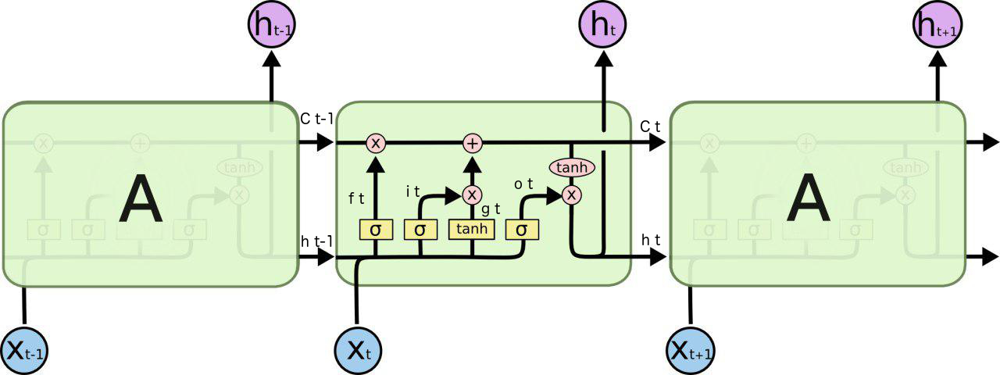
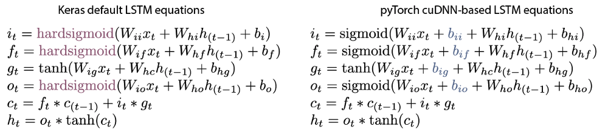

# Building LSTM Networks


## LSTM cells



Sequential processing in LSTM, from: [http://colah.github.io/posts/2015-08-Understanding-LSTMs/](http://colah.github.io/posts/2015-08-Understanding-LSTMs/)



Keras default LSTM VS pyTorch default LSTM, from: [Understanding emotions — from Keras to pyTorch](https://medium.com/huggingface/understanding-emotions-from-keras-to-pytorch-3ccb61d5a983)

```python
def LSTMCell(input, hidden, w_ih, w_hh, b_ih=None, b_hh=None):
    """
    A modified LSTM cell with hard sigmoid activation on the input, forget and output gates.
    """
    hx, cx = hidden
    gates = F.linear(input, w_ih, b_ih) + F.linear(hx, w_hh, b_hh)

    ingate, forgetgate, cellgate, outgate = gates.chunk(4, 1)

    ingate = hard_sigmoid(ingate)
    forgetgate = hard_sigmoid(forgetgate)
    cellgate = F.tanh(cellgate)
    outgate = hard_sigmoid(outgate)

    cy = (forgetgate * cx) + (ingate * cellgate)
    hy = outgate * F.tanh(cy)

    return hy, cy

def hard_sigmoid(x):
    """
    Computes element-wise hard sigmoid of x.
    See e.g. https://github.com/Theano/Theano/blob/master/theano/tensor/nnet/sigm.py#L279
    """
    x = (0.2 * x) + 0.5
    x = F.threshold(-x, -1, -1)
    x = F.threshold(-x, 0, 0)
return x
```